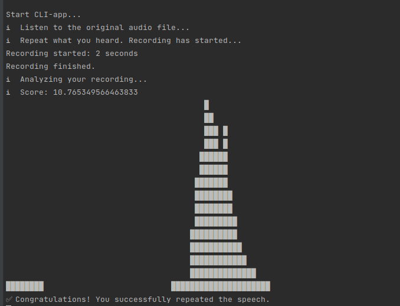
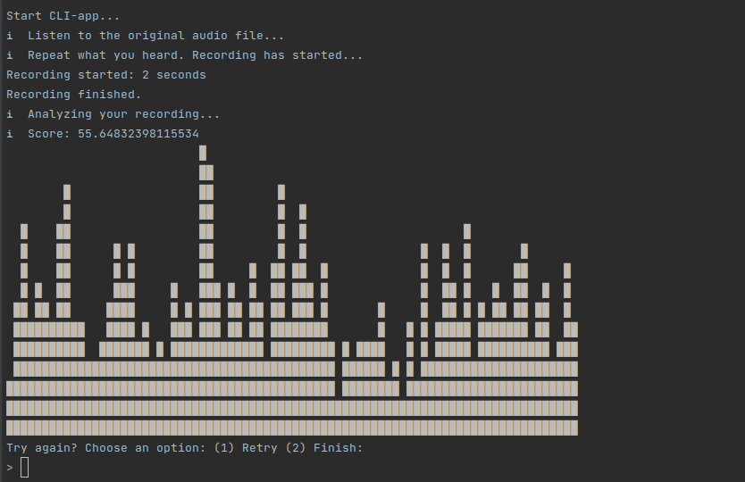

# Incredible Diction App (Test Console Version)

Welcome to the test version of the **Incredible Diction App**! This application helps you train your diction skills in an engaging and interactive way.

---

## 📄 Description
The app allows you to:
- Listen to sample audio clips. (At the moment, the application supports one sample audio file)
- Repeat what you hear using your microphone.
- Analyze your performance through a sound graph.

---

## 🚀 How to Use
1. **Listen:** Play a sample audio provided by the app.
2. **Repeat:** Speak into the microphone and replicate the audio you heard.
3. **Analyze:** Wait for the app to process your input and display the results, including a visual sound graph.

---

## ⚠️ Attention
This application is currently running in **test mode**.  
Results may sometimes be **inaccurate**, either overestimating or underestimating your diction performance.

---

##📝 Notes
Make sure your microphone is working properly for the best experience.
If you encounter any issues, feel free to report them via the issue tracker.

---

## 🔊 Example of work
### Successfully


### Failed


---

## 🛠️ Installation
Follow these steps to set up the app locally:

1. Clone the repository:
   ```bash
   git clone <https://github.com/yuriyzhupikov/incredibleDiction.git>
2. Install the dependencies
    ```
   npm install
3. Ensure sox (Sound eXchange) is installed on your system. If not, install it using:
    ```
    sudo apt install sox
